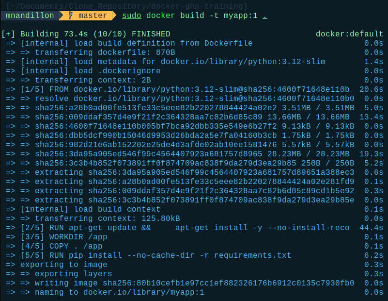
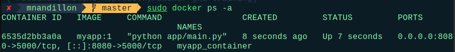
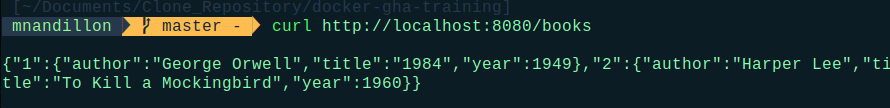
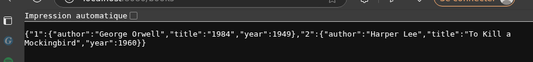

---

# 🐳 Deploying the Flask Application with Docker

This guide explains how to build and run the Flask application in this project using Docker.

---

## 📁 Project Structure (simplified)

```
.
├── app/
│   └── main.py
├── pyproject.toml
├── poetry.lock
└── Dockerfile
```

---

## ✅ Prerequisites

- [Docker installed](https://docs.docker.com/get-docker/)
    
- Internet connection (to pull images)
    
- Project cloned or forked, with required files (`Dockerfile`, `pyproject.toml`, etc.)
    [link repo](https://github.com/NANDILLONMaxence/docker-gha-training)

---

## ⚙️ Steps

### 1. Update `main.py`

Ensure that the `app/main.py` file ends with the following block:

```python
if __name__ == '__main__':
    app.run(host='0.0.0.0', port=5000)
```

This allows Flask to listen on all network interfaces, making it accessible from outside the container.

---

### 2. Create and Build the Docker image
```bash
nano Dockerfile
```
Insert the configuration :
```Dockerfile
FROM python:3.12-slim AS builder

WORKDIR /app

# Installer poetry
RUN pip install --no-cache-dir poetry

# Copier les fichiers de dépendances
COPY pyproject.toml poetry.lock ./

# Installer les dépendances sans installer le projet lui-même
# J'ai des erreurs, je n'arrive pas a lancer poetry, j'ai donc mis false :(
RUN poetry config virtualenvs.create false \
  && poetry install --only main --no-root --no-interaction --no-ansi

# Copier le code source
COPY app app/

# Étape finale
FROM python:3.12-slim

WORKDIR /app

# Copier l’environnement Python
COPY --from=builder /usr/local/lib/python3.12 /usr/local/lib/python3.12
COPY --from=builder /app /app

EXPOSE 5000

CMD ["python", "app/main.py"]
```

Run this command from the root of the project:

```bash
docker build -t myapp:1 .
```

- `myapp`: the image name
    
- `:1`: the version tag
    

---

### 3. Run the container

```bash
docker run -d -p 8080:5000 --name myapp_container myapp:1
```

- `-p 8080:5000`: maps port 5000 in the container to port 8080 on your machine
    
- `--name myapp_container`: gives the container a custom name
    

---

### 4. Verify the container is running

```bash
docker ps
```

You should see a row with the name `myapp_container` and the correct ports listed.

---

### 5. Test the API

Use `curl` to check the `/books` endpoint:

```bash
curl http://localhost:8080/books
```


Expected response:

```json
{
  "1": {
    "title": "1984",
    "author": "George Orwell",
    "year": 1949
  },
  "2": {
    "title": "To Kill a Mockingbird",
    "author": "Harper Lee",
    "year": 1960
  }
}
```



---

## 🛑 Stop and remove the container

```bash
docker stop myapp_container
docker rm myapp_container
```

---

## 📌 Command Summary

```bash
docker build -t myapp:1 .
docker run -d -p 8080:5000 --name myapp_container myapp:1
docker ps
curl http://localhost:8080/books
```

---

Let me know if you'd like this in `markdown` format for your `README.md`, or if you want to add Docker Compose or GitHub Actions support!