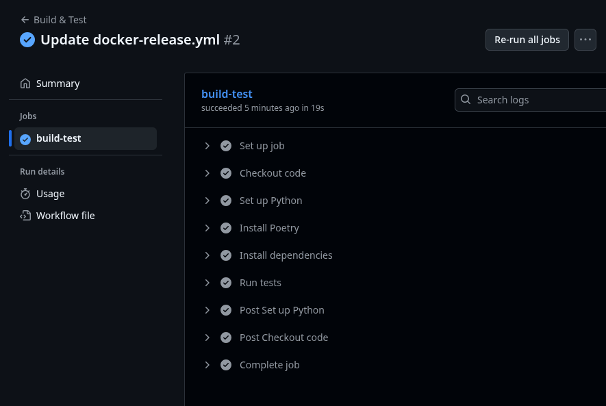
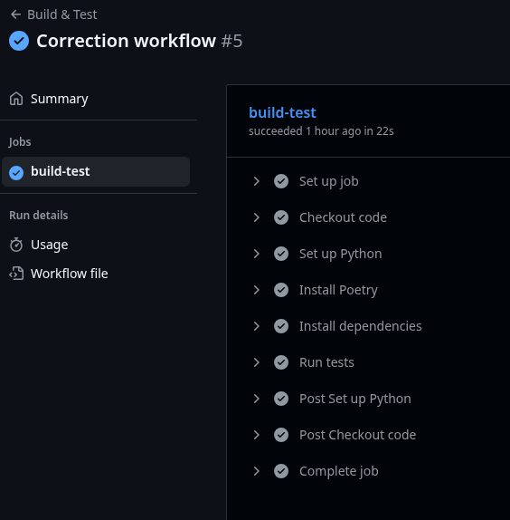

---

# GitHub Actions Documentation: Build, Test & Docker Release

This guide explains how to automate building and testing your Python project, then build and push a Docker image to Docker Hub using GitHub Actions.

---

## 1. Prepare the GitHub Actions workflows

### 1.1 Create the workflows folder

From your project root, run this command in your terminal:

```bash
mkdir -p .github/workflows
```

---

### 1.2 Add the build-test.yml workflow

Create a file `.github/workflows/build-test.yml` with the following content:

```yaml
name: Build & Test

on:
  push:
    branches: [ "**" ]
  pull_request:

jobs:
  build-test:
    runs-on: ubuntu-latest

    steps:
      - name: Checkout code
        uses: actions/checkout@v4

      - name: Set up Python
        uses: actions/setup-python@v5
        with:
          python-version: '3.12'

      - name: Install Poetry
        run: |
          curl -sSL https://install.python-poetry.org | python3 -
          echo "$HOME/.local/bin" >> $GITHUB_PATH

      - name: Install dependencies
        run: |
          poetry config virtualenvs.create false
          poetry install --only main --no-root

      - name: Run tests
        run: |
          echo "No tests defined yet"
```

---

### 1.3 Add the docker-release.yml workflow

Create `.github/workflows/docker-release.yml`:

```yaml
name: Docker Release

on:
  push:
    branches: [ "main" ]

jobs:
  build-and-push:
    runs-on: ubuntu-latest

    steps:
      - name: Checkout code
        uses: actions/checkout@v4

      - name: Log in to Docker Hub
        uses: docker/login-action@v3
        with:
          username: ${{ secrets.DOCKER_USERNAME }}
          password: ${{ secrets.DOCKER_PASSWORD }}

      - name: Set up Docker Buildx
        uses: docker/setup-buildx-action@v3

      - name: Build and Push image
        uses: docker/build-push-action@v5
        with:
          context: .
          file: ./Dockerfile
          push: true
          tags: yourdockerhubuser/myapp:1
```

**Remember to replace** `yourdockerhubuser` with your actual Docker Hub username.

---

## 2. Get your DOCKER_USERNAME and DOCKER_PASSWORD (PAT)

### 2.1 Find your DOCKER_USERNAME (Docker Hub username)

1. Go to [hub.docker.com](https://hub.docker.com/)
    
2. Log in to your account
    
3. Click your avatar in the top-right corner
    
4. You’ll see your username (e.g., `johnsmith42`)
    
5. This is your `DOCKER_USERNAME`
    

---

### 2.2 Create a Personal Access Token (PAT) for DOCKER_PASSWORD

> **Important:** Do **not** use your Docker Hub password directly. Use a Personal Access Token (PAT) instead for security.

1. On [hub.docker.com](https://hub.docker.com/), logged in, go to **Account Settings > Security**  
    Or directly: [https://hub.docker.com/settings/security](https://hub.docker.com/settings/security)
    
2. Under **Access Tokens**, click **New Access Token**
    
3. Give it a name (e.g., `github-actions`)
    
4. Set permissions to **Read/Write**
    
5. Click **Generate**
    
6. Copy the token right away (you won’t see it again)
    

---

## 3. Add these secrets to your GitHub repository

1. On GitHub, open your repository → **Settings > Secrets and variables > Actions**
    
2. Click **New repository secret**
    
3. Add two secrets:
    

|Name|Value|
|---|---|
|DOCKER_USERNAME|Your Docker Hub username|
|DOCKER_PASSWORD|Your generated PAT (access token)|

---

## 4. Push the workflows to GitHub

In your terminal, run:

```bash
git add .github/workflows/*
git commit -m "Add CI workflows for build/test and docker release"
git push origin main  # or your working branch
```

---

## 5. Monitor your Actions

- On GitHub, go to the **Actions** tab
    
- The **Build & Test** workflow will run on every push or pull request
    
- The **Docker Release** workflow runs only when pushing to the `main` branch
    





---
